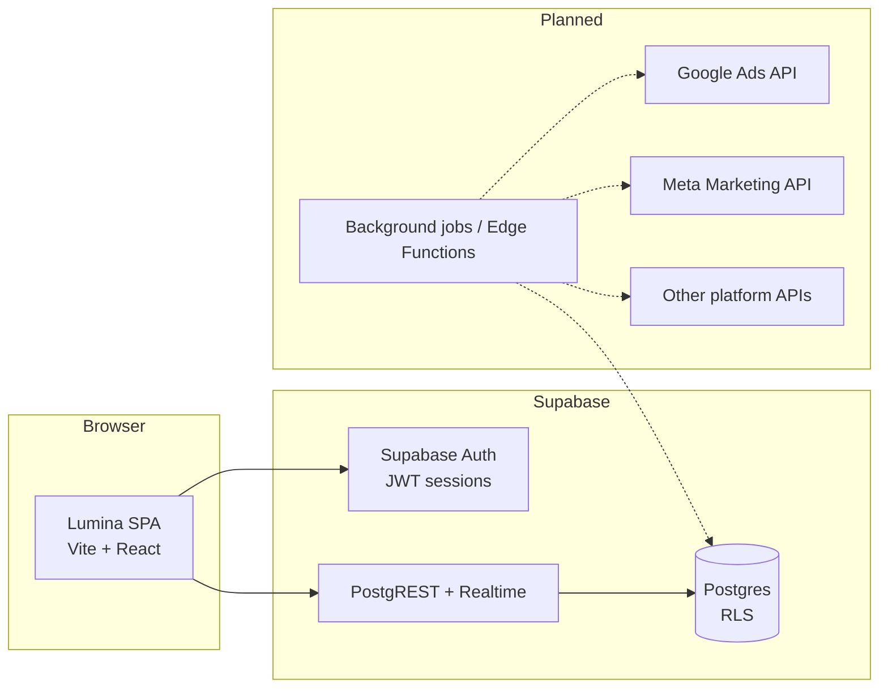
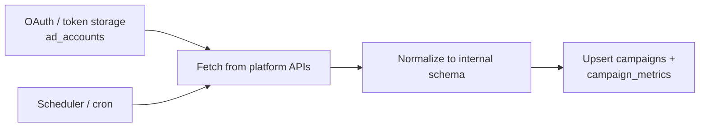

# Lumina — Technical Documentation

This document describes the **Lumina** ads analytics web application as implemented in this repository: architecture, auth, data model, integrations, and planned Google Ads usage.

---

## 1. Product overview

**Lumina** is a multi-channel advertising analytics dashboard. The product goal is to give marketers a single workspace to review performance across major ad platforms (Google Ads, Meta, TikTok, Snapchat, X), with KPIs, charts, campaign tables, and insights-oriented UI.

**Current implementation status**

| Area | Status |
|------|--------|
| Frontend UI (dashboard, channels, campaigns, insights, settings) | Implemented (Vite + React) |
| Authentication | Supabase Auth (email/password); SaaS-style signup → sign-out → manual login |
| Backend database | Supabase Postgres schema + RLS defined; apply via migration SQL |
| Live ad platform APIs | **Not connected** — OAuth and sync jobs are planned; placeholder helpers store account rows only |
| Dashboard metrics source | **Demo/static data** in React pages — not yet wired to `campaign_metrics` queries |

The codebase is structured so analytics pages can later consume `user_id`-scoped data from Supabase using the existing client and RLS model.

---

## 2. System architecture

### High-level diagram

### Layers

1. **Presentation** — React 18, React Router 6, Tailwind CSS, shadcn/ui-style components, Recharts, Framer Motion, TanStack Query (available for server state).
2. **Client services** — `@supabase/supabase-js` for Auth and Postgres access; typed helpers under `src/lib/`.
3. **Backend** — Supabase-hosted Postgres with Row Level Security; no custom REST server in this repo.
4. **Future ingestion** — Platform APIs are expected to be called from **secure workers** (Supabase Edge Functions, queue workers, or a small Node service), not from the browser with platform secrets.

---

## 3. User flow

### Authentication (implemented)

1. Unauthenticated user hits a protected route → redirected to `/login` with optional `state.from` (return path).
2. **Sign up**
   - User submits email/password (minimum length enforced client-side).
   - `signUpUser` → Supabase creates the user; may create a session depending on project settings.
   - App calls `signOutUser` to enforce **manual login** after registration.
   - User sees success UI and can use **Go to Login** to clear state and use the sign-in form.
3. **Sign in**
   - `signInUser` → JWT session stored by Supabase client (browser persistence).
4. **Session**
   - `SupabaseAuthProvider` + `onAuthStateChange` keep `currentUser` / `userId` in sync.
5. **Sign out**
   - Profile menu → `signOutUser` → redirect to `/login`.

### Application navigation (authenticated)

- `/` — Dashboard  
- `/channels` — Channel comparison  
- `/campaigns` — Campaign table  
- `/insights` — Insights  
- `/settings` — Settings  

Command palette (⌘K-style) is shown only when authenticated.

---

## 4. API integrations

### Supabase (active)

| Surface | Purpose |
|---------|---------|
| **Auth** | `signUp`, `signInWithPassword`, `signOut`, `getUser`, session refresh |
| **PostgREST** | CRUD on `public` tables via `@supabase/supabase-js` with user JWT |
| **Environment** | `VITE_SUPABASE_URL`, `VITE_SUPABASE_ANON_KEY` (optional `NEXT_PUBLIC_*` aliases via Vite `envPrefix`) |

Configuration reference: `.env.example`.

### Ad platform APIs (planned)

There is **no** direct call to Google Ads, Meta, TikTok, Snapchat, or X APIs from this SPA in the current codebase.  

`src/lib/database/platformConnections.ts` exposes **placeholder** functions (`connectGoogleAds`, `connectMetaAds`, etc.) that insert rows into `ad_accounts` for future OAuth wiring.

---

## 5. Data pipeline

### Current state

- **No ETL pipeline is deployed** in this repository.
- Dashboard numbers and charts are **static or locally mocked** in page components.

### Intended pipeline (target architecture)

1. **Connect account** — User completes OAuth; refresh/access tokens stored in `ad_accounts` (server-side recommended for production).
2. **Sync job** — Periodic job (e.g. every hour) per connected account:
   - List campaigns and daily stats from each platform.
   - Map external IDs to `campaigns.campaign_id` and internal UUID `campaigns.id`.
   - Upsert `campaign_metrics` rows keyed by `(campaign_id, date)`.
3. **Read path** — SPA queries Supabase with the logged-in user’s JWT; RLS restricts rows to `auth.uid()`.

### Aggregation helpers (implemented in code)

`src/lib/database/dashboard.ts` aggregates `campaign_metrics` for a `userId` by resolving that user’s campaigns, then summing/averaging metrics. These are ready once real data exists.

---

## 6. Security model

### Authentication

- **Supabase Auth** issues JWTs; the JS client attaches the access token to API calls.
- Passwords never stored in app code; handled by Supabase.

### Authorization (database)

- **Row Level Security (RLS)** is enabled on `ad_accounts`, `campaigns`, and `campaign_metrics`.
- Policies require `user_id = auth.uid()` for account and campaign rows.
- Metrics are allowed only when the parent campaign belongs to `auth.uid()`.

### Secrets

- Only the **anon** key is used in the browser. It is safe **only** because RLS is enforced.
- **Service role** keys and platform API client secrets must not ship to the client; use server-side workers for those.

### Transport

- HTTPS for production; Supabase URLs use TLS.

---

## 7. Technology stack

| Layer | Technology |
|-------|------------|
| Language | TypeScript |
| UI framework | React 18 |
| Build tool | Vite 5 |
| Routing | React Router 6 |
| Styling | Tailwind CSS 3, tailwindcss-animate |
| Components | Radix UI primitives, shadcn-style UI under `src/components/ui` |
| Charts | Recharts |
| Motion | Framer Motion |
| Theming | next-themes |
| Notifications | Sonner, Radix toast |
| Data fetching (ready) | TanStack Query |
| Backend | Supabase (Auth + Postgres) |
| Tests | Vitest; Playwright config present |

---

## 8. Database structure

Schema is defined in `supabase/migrations/20250325000000_initial_schema.sql`. TypeScript types live in `src/lib/database/types.ts`.

### `auth.users` (Supabase managed)

- Referenced by `user_id` in application tables.

### `public.ad_accounts`

| Column | Type | Notes |
|--------|------|--------|
| `id` | uuid PK | |
| `user_id` | uuid FK → `auth.users` | Tenant key |
| `platform` | text | `google_ads`, `meta_ads`, `tiktok_ads`, `snapchat_ads`, `x_ads` |
| `account_id` | text | External account id |
| `account_name` | text | Display name |
| `access_token` | text nullable | OAuth access (store securely in production) |
| `refresh_token` | text nullable | OAuth refresh |
| `created_at` | timestamptz | |

Unique: `(user_id, platform, account_id)`.

### `public.campaigns`

| Column | Type | Notes |
|--------|------|--------|
| `id` | uuid PK | Internal id |
| `user_id` | uuid FK | |
| `platform` | text | Same enum as above |
| `account_id` | text | Links to ad account context |
| `campaign_id` | text | External campaign id |
| `campaign_name` | text | |
| `status` | text | Default `unknown` |
| `daily_budget` | numeric nullable | |
| `created_at` | timestamptz | |

Unique: `(user_id, platform, campaign_id)`.

### `public.campaign_metrics`

| Column | Type | Notes |
|--------|------|--------|
| `id` | uuid PK | |
| `campaign_id` | uuid FK → `campaigns.id` | ON DELETE CASCADE |
| `date` | date | Grain (usually daily) |
| `spend`, `revenue` | numeric | |
| `impressions`, `clicks`, `conversions` | integer | |
| `ctr`, `cpa`, `roas` | numeric nullable | Derived or synced |

Unique: `(campaign_id, date)`.

---

## 9. How Google Ads API will be used

This section describes the **intended** integration. It is not fully implemented in the repository.

### Purpose

- Pull **campaigns** and **performance metrics** (cost, impressions, clicks, conversions, etc.) for Google Ads customers linked to Lumina users.

### Recommended architecture

1. **OAuth 2.0 (Google)**  
   - Web flow or offline access to obtain **refresh token** for the Google Ads account / MCC.  
   - Store refresh token (encrypted) associated with `ad_accounts` where `platform = 'google_ads'`.

2. **API surface**  
   - Use the **Google Ads API** (REST/gRPC via official client libraries in a **backend** process).  
   - Typical resources: `Customer`, `Campaign`, reporting via `GoogleAdsService.Search` / `SearchStream` with GAQL queries for date-segmented metrics.

3. **Mapping to Lumina schema**  
   - **Account**: Google Ads `customer.id` → `ad_accounts.account_id`.  
   - **Campaign**: Google Ads `campaign.id` → `campaigns.campaign_id`; set `campaign_name`, `status`, budgets as available.  
   - **Metrics**: For each day, map cost → `spend`, user-defined conversion value (if configured) → `revenue`, etc., into `campaign_metrics`.

4. **Sync frequency**  
   - Scheduled jobs (hourly/daily) to respect API quotas; incremental sync by date range.

5. **Why not call from the browser**  
   - Developer tokens and client secrets must not be exposed. A worker with **service credentials** or stored refresh tokens performs sync and writes to Supabase using a **service role** or a **user-scoped** Edge Function that validates the user.

### Placeholder in codebase

- `connectGoogleAds(...)` inserts a row into `ad_accounts` for `google_ads` — replace with real OAuth + token persistence before production.

---

## Appendix: Key source locations

| Concern | Path |
|---------|------|
| App routes & providers | `src/App.tsx` |
| Auth session | `src/hooks/useAuth.tsx` |
| Route guard | `src/components/ProtectedRoute.tsx` |
| Login / signup UX | `src/pages/Login.tsx` |
| Supabase client | `src/lib/supabaseClient.ts` |
| Auth helpers | `src/lib/auth/index.ts` |
| DB access & aggregates | `src/lib/database/` |
| SQL migration | `supabase/migrations/20250325000000_initial_schema.sql` |

---

*Document generated to match the repository as of the latest known structure. Update this file when OAuth, sync jobs, or dashboard-to-database wiring lands.*
